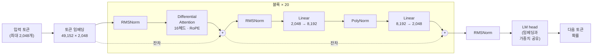
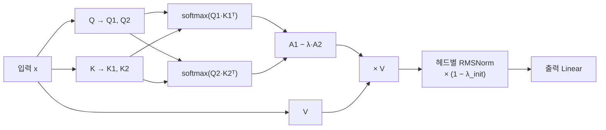

# Perdix

작은 수준의 LLM으로 이름은 그리스 신화의 페르딕스에서 따왔습니다. 다이달로스의 어린 제자였고 톱과 컴퍼스를 발명했는데, 탑에서 떨어지다 자고새가 되는 바람에 그 뒤로는 낮게만 날아다닌다고 합니다. 지금 이 모델 수준이 딱 그렇습니다.

## 구조

기본 구조는 decoder-only 트랜스포머입니다(pre-RMSNorm, RoPE, 임베딩 공유).

- **Differential Attention.** 어텐션 맵을 두 개 만들어 하나에서 다른 하나를 뺍니다. 양쪽에 공통으로 끼는 잡음을 상쇄하려는 아이디어입니다.
- **PolyNorm.** 활성 함수 자리에 x, x², x³을 각각 정규화해서 학습되는 가중치로 섞어 씁니다.

전체 구조는 이렇습니다. 같은 블록을 20번 쌓았고, 각 블록은 어텐션과 FFN 앞에서 정규화한 뒤 결과를 원래 값에 더합니다.



Differential Attention 한 헤드 안에서는 이런 일이 일어납니다. 쿼리와 키를 반으로 쪼개 어텐션 맵을 두 개 만들고, 둘의 차이를 값(V)에 적용합니다. λ는 학습되는 값입니다.



구현에 참고된 자료: Motif-2.6B 기술보고서([arXiv:2508.09148](https://arxiv.org/abs/2508.09148))와 Differential Transformer(Ye et al., 2024)

데이터는 영어 웹(DCLM-baseline), 한국어 웹(FineWeb2), 수학(FineMath 4+) 이용.

## 사전 학습.

```bash
python3 pretrain_data.py        # parquet을 토큰 바이너리로 변환 (packed/ 에 쌓임)
python3 pretrain.py --smoke     # 아주 작은 설정으로 일단 도는지 확인
python3 pretrain.py --compile   # 본 학습
python3 pretrain.py --resume ckpt/latest.pt
```

데이터 경로는 `pretrain_data.py` 를 이용하되 본인 환경에 맞게 수정해야 함.
 학습 설정(토큰 예산, 배치, 학습률, 믹싱 비율)은 전부 `pretrain.py` 맨 위 상수입니다.

## 지시 미세조정(SFT).

```bash
python3 sft_data.py              # sft_data/ 의 대화 데이터를 ChatML로 토큰화 (sft_packed/ 에 쌓임)
python3 sft_train.py --smoke     # 20스텝만 돌려 보기
python3 sft_train.py --compile   # 본 학습 (ckpt/sft_latest.pt 있으면 재개, 끝나면 ckpt/sft_final.pt)
```

대화 데이터는 smoltalk, kullm-v2, open-korean-instructions(koalpaca, OIG, korquad-chat)를 `sft_data/` 아래에 두고 이용. 소스별 건수와 반복 횟수는 `sft_data.py` 위쪽 `SMOLTALK`, `KOREAN` 표에서 조정.
 `sft_data.py`가 토크나이저에 `<|im_start|>`, `<|im_end|>`를 추가해 `tokenizer/tokenizer_chat.json`으로 저장하고, 학습은 `ckpt/final.pt`(베이스)에서 시작해 임베딩을 토큰 2개만큼 늘립니다. loss는 답변 구간만 계산.

## 추론 API.

```bash
python3 api_server.py                        # ckpt/sft_final.pt 를 OpenAI 호환 chat API로 띄움 (포트 8000)
python3 perdix_api_test.py                   # 질문 묶음을 보내 서버·모델 점검 (배치 테스트)
python3 perdix_api_test.py -q "질문" --temp 0  # 직접 질문, greedy
python3 perdix_interactive.py                # 터미널에서 대화 (멀티턴, 스트리밍)
```

서버 경로와 포트는 `CKPT`, `TOK`, `PORT` 환경변수로 변경(기본값은 컨테이너 안 `/ws/` 기준). `/v1/chat/completions`에 `messages`와 `temperature`(0이면 greedy), `top_k`, `top_p`, `repetition_penalty`, `max_tokens`, `stream`을 받고 `<|im_end|>`에서 멈춤.
 클라이언트 둘은 표준 라이브러리만 사용. 서버 주소는 첫 인자나 `PERDIX_URL` 환경변수로 지정. 대화 중에는 `/reset`, `/system <문장>`, `/temp <값>`, `/quit` 명령 사용 가능.

GPU 장비에서는 컨테이너로 띄움.

```bash
docker run -d --name perdix-serve --rm --gpus all -p 8000:8000 -v $(pwd):/ws -w /ws <pytorch 이미지> \
  bash -c "pip install -q fastapi uvicorn; python -u api_server.py"
```

## 허깅 페이스 변환.

올라가 있는 모델:

- [prismdata/Perdix-1.1B-Base](https://huggingface.co/prismdata/Perdix-1.1B-Base) — 사전학습만 한 베이스. 이어쓰기만 함.
- [prismdata/Perdix-1.1B-Instruct](https://huggingface.co/prismdata/Perdix-1.1B-Instruct) — SFT까지 한 대화 모델. ChatML `chat_template` 포함.

```bash
python3 hf/convert_to_hf.py ckpt/final.pt Perdix-1.1B-Base            # .pt → HF 폴더 (config, safetensors, 토크나이저, 모델 코드, 모델 카드)
python3 hf/convert_to_hf.py ckpt/sft_final.pt Perdix-1.1B-Instruct    # SFT는 vocab 크기로 자동 구분, chat_template과 eos=<|im_end|> 포함
python3 hf/test_hf_load.py Perdix-1.1B-Instruct ckpt/sft_final.pt     # AutoModel로 불러 원본과 logits 비교, 생성 확인
hf upload prismdata/Perdix-1.1B-Instruct Perdix-1.1B-Instruct .       # 허브에 올리기
```

불러올 때는 `trust_remote_code=True` 필요(`hf/modeling_perdix.py`, `hf/configuration_perdix.py`가 폴더에 함께 들어감). transformers 4.x, 5.x 모두 확인함.

## 들여다보기.

```bash
python3 inspect_model.py ckpt/final.pt                 # 체크포인트 구조 (가중치 로드 없이)
python3 inspect_model.py Perdix-1.1B-Base              # HF 폴더도 가능
python3 inspect_model.py model.safetensors --tensors   # 전체 텐서 나열
python3 inspect_data.py korean --n 5                   # 원본 parquet 문서 보기 (korean / web_en / math)
python3 inspect_data.py all --n 1000 --out samples/    # 소스별 1,000문서를 jsonl로 추출
```

`inspect_data.py`의 원본 경로는 `pretrain_data.py`와 같이 본인 환경에 맞게 수정해야 함.

## 들어 있는 파일

- `model.py` — 모델 본체. `PerdixConfig`, `PerdixSLM`
- `pretrain.py`, `pretrain_data.py` — 사전학습과 데이터 준비
- `sft_train.py`, `sft_data.py` — 지시 미세조정(SFT)과 대화 데이터 준비
- `api_server.py` — SFT 체크포인트를 OpenAI 호환 chat API로 띄우는 서버
- `perdix_api_test.py` — 위 서버에 질문 묶음을 보내 점검하는 배치 테스트
- `perdix_interactive.py` — 위 서버에 붙어 터미널에서 대화
- `inspect_model.py`, `inspect_data.py` — 모델 파일 구조와 학습 데이터를 들여다보는 도구
- `hf/` — 허깅 페이스 형식으로 변환하는 코드와 모델 카드(베이스, Instruct)

## 라이선스

Apache-2.0
