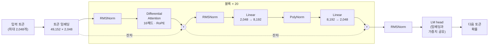
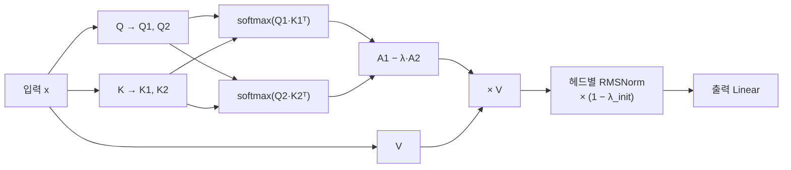

# Perdix

작은 수준의 LLM으로 이름은 그리스 신화의 페르딕스에서 따왔습니다. 다이달로스의 어린 제자였고 톱과 컴퍼스를 발명했는데, 탑에서 떨어지다 자고새가 되는 바람에 그 뒤로는 낮게만 날아다닌다고 합니다. 지금 이 모델 수준이 딱 그렇습니다.

## 솔직한 현재 상태

아직 할 줄 아는 게 이어쓰기뿐입니다. 문장 앞부분을 주면 뒤를 그럴듯하게 잇는 정도이고, 질문에 답하거나 지시를 따르지는 못합니다. 대화 데이터로는 한 번도 학습시키지 않았으니 당연한 결과입니다.

크기는 1.1B 파라미터입니다. 처음엔 350M으로 시작했다가 중간에 키웠습니다. 학습에는 30B 토큰을 썼고, 장비 한 대에서 초당 6,600토큰 정도 나와서 꼬박 50일 넘게 걸렸습니다. loss는 10.7에서 시작해 2.3 근처에서 끝났습니다.

가중치는 여기 올리지 않았습니다.

## 어떻게 만들었나

기본 뼈대는 흔한 decoder-only 트랜스포머입니다(pre-RMSNorm, RoPE, 임베딩 공유). 거기에 두 가지를 넣었습니다.

- **Differential Attention.** 어텐션 맵을 두 개 만들어 하나에서 다른 하나를 뺍니다. 양쪽에 공통으로 끼는 잡음을 상쇄하려는 아이디어입니다.
- **PolyNorm.** 활성 함수 자리에 x, x², x³을 각각 정규화해서 학습되는 가중치로 섞어 씁니다.

전체 구조는 이렇습니다. 같은 블록을 20번 쌓았고, 각 블록은 어텐션과 FFN 앞에서 정규화한 뒤 결과를 원래 값에 더합니다.



Differential Attention 한 헤드 안에서는 이런 일이 일어납니다. 쿼리와 키를 반으로 쪼개 어텐션 맵을 두 개 만들고, 둘의 차이를 값(V)에 적용합니다. λ는 학습되는 값입니다.



둘 다 제가 고안한 게 아니고 Motif-2.6B 기술보고서([arXiv:2508.09148](https://arxiv.org/abs/2508.09148))와 Differential Transformer(Ye et al., 2024)를 읽고 직접 구현해 본 것입니다. 원 저자들과는 관계없는 개인 구현이라, 틀린 부분이 있다면 제 실수입니다.

데이터는 영어 웹(DCLM-baseline), 한국어 웹(FineWeb2), 수학(FineMath 4+) 세 가지를 섞었습니다. 처음엔 영어를 65%로 많이 먹이다가 끝으로 갈수록 한국어 50%, 수학 25%까지 올리는 식으로 비율을 서서히 바꿨습니다. 학습률은 워밍업 뒤 쭉 유지하다 마지막 20% 구간에서만 내렸습니다.

## 돌려 보려면

```bash
python3 tokenize_pack.py     # parquet을 토큰 바이너리로 변환 (packed/ 에 쌓임)
python3 train.py --smoke     # 아주 작은 설정으로 일단 도는지 확인
python3 train.py --compile   # 본 학습
python3 train.py --resume ckpt/latest.pt
```

데이터 경로는 `tokenize_pack.py` 위쪽에 적혀 있으니 본인 환경에 맞게 고쳐야 합니다. 학습 설정(토큰 예산, 배치, 학습률, 믹싱 비율)은 전부 `train.py` 맨 위 상수입니다.

## 들어 있는 파일

- `model.py` — 모델 본체. `PerdixConfig`, `PerdixSLM`
- `train.py`, `tokenize_pack.py` — 학습과 데이터 준비
- `serve_slm.py`, `test_slm_infer.py` — 체크포인트를 띄워서 이어쓰기 시켜 보는 용도
- `inspect_model.py`, `view_data.py` — 모델 파일 구조와 학습 데이터를 들여다보는 도구
- `serve_hf.py`, `serve_hf_tools.py` — 허깅 페이스 형식 모델을 OpenAI 호환 API로 띄우는 서버. `MODEL_PATH` 환경변수로 모델 폴더를 지정합니다. `_tools` 쪽이 툴콜까지 처리합니다.
- `test_hf_infer.py`, `test_hf_toolcall.py`, `test_api_toolcall.py` — 위 서버와 모델이 툴콜을 제대로 하는지 확인하는 테스트

## 라이선스

Apache-2.0
